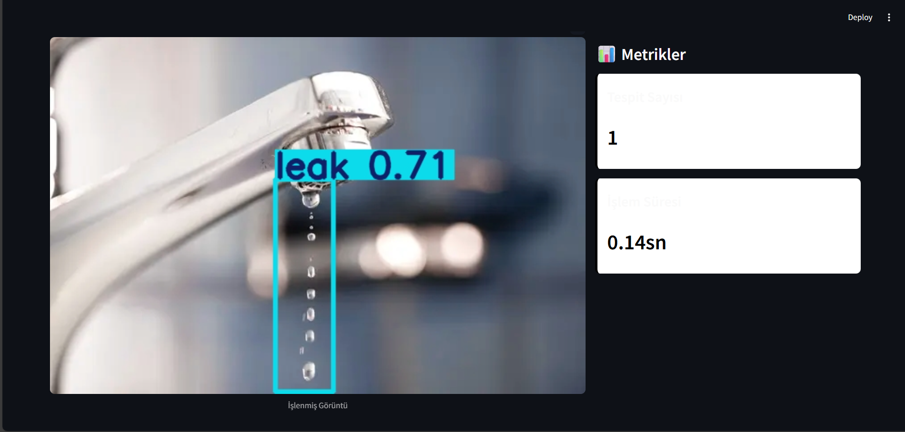
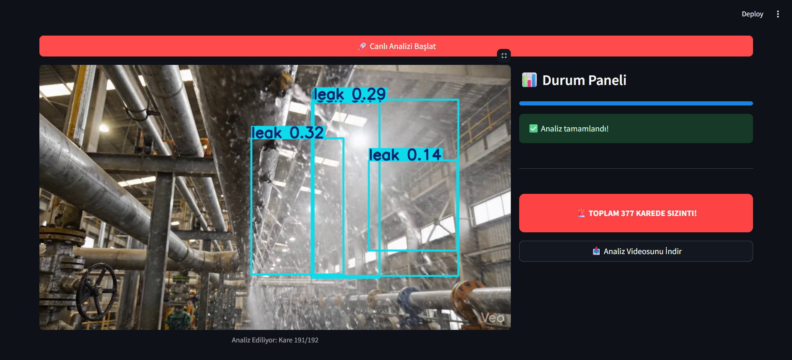
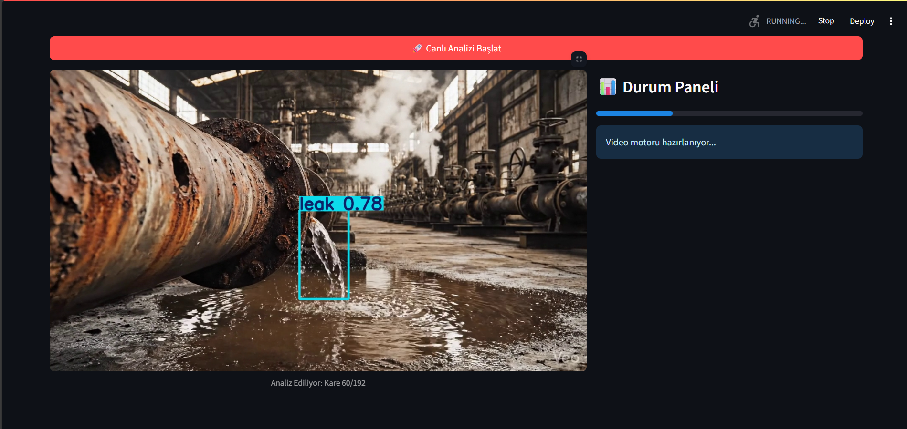

<h1 align="left">🛡️ SAFEFLOW AI: INDUSTRIAL SAFETY & LEAK DETECTION TERMINAL 🏭</h1>

      

## 🌐 PROJE VİZYONU VE ENDÜSTRİYEL ETKİ 🚀

SafeFlow AI, modern akıllı fabrikaların (Industry 4.0) en kritik bileşenlerinden biri olan iş güvenliği ve kaynak yönetimi için tasarlanmıştır. Geleneksel denetim yöntemleri yavaş, maliyetli ve insan hatasına açıktır.

Bu sistem, YOLOv8s mimarisini kullanarak endüstriyel boru hatlarını, kaynak noktalarını ve depolama tanklarını milisaniyeler içerisinde tarar. Sadece bir sızıntı tespit aracı değil, aynı zamanda tesisin dijital ikizine veri sağlayan bir erken uyarı terminalidir.

### ✨ TEMEL ÖZELLİKLER VE MODÜLLER 🛠️

## 📸 1. Akıllı Fotoğraf Analiz Modülü

Yüklenen durağan görseller üzerinde derinlemesine piksel taraması yapar. En küçük çatlaklardan (hairline cracks) büyük fışkırmalara kadar her şeyi sınıflandırır.

Hassas Tespit: 0.15 güven eşiği ile en ufak damlacıkları bile kaçırmaz.

Hızlı Raporlama: Ortalama 0.14 saniye işlem süresi ile anlık sonuç üretir.

  

## 🎥 2. Canlı Video Akış Terminali

Fabrika içerisindeki CCTV veya IP kameralardan gelen akışları gerçek zamanlı olarak işler.

Dinamik İşaretleme: Sızıntı bölgelerini 4px kalınlığında, yüksek görünürlüklü kutularla vurgular.

Kümülatif Analiz: Tüm video boyunca toplam kaç karede hata olduğunu hesaplar ve kritik eşik aşılınca alarm verir.

   

## 🧠 TEKNİK DERİNLİK VE MODEL EĞİTİMİ 📈
Modelimiz, endüstriyel sahalardaki karmaşık görüntüleri (toz, duman, düşük ışık) tolere edebilecek şekilde Tesla T4 GPU üzerinde 100 epoch boyunca eğitilmiştir.

📊 Model Metrikleri
Veri Seti Genişliği: 1.200 orijinal görsel, veri artırma (augmentation) ile 11.000 e yakın görsel.

Başarı Oranı (mAP50): %96.8 gibi rekor bir doğruluk seviyesi.

Performans Formülasyonu: Modelimiz, her kare için Ortalama Hassasiyeti (mAP) maksimize ederken, Kayıp (Loss) fonksiyonunu minimize edecek şekilde optimize edilmiştir:

mAP= 
n
1
​
  
i=1
∑
n
​
 AP 
i
​

## ⚙️ Kurulum ve Çalıştırma

Bu projeyi kendi bilgisayarınızda çalıştırmak için aşağıdaki adımları izleyin.

### 1. Projeyi Klonlayın

git clone [https://github.com/muhammetCicekdag/SafeFlow](https://github.com/muhammetCicekdag/SafeFlow)

cd SafeFlow

### 2. Gerekli Kütüphaneleri Yükleyin
pip install streamlit ultralytics opencv-python pillow pandas numpy

### 3. Uygulamayı Başlatın
python -m streamlit run app.py

📂 PROJE DOSYA MİMARİSİ 🏢  ->Plaintext

📦 SafeFlow-AI

 ┣ 📂 images            # Projenin görsel vitrini (Tüm ekran görüntüleri burada)
 
 ┣ 📜 app.py            # Dashboard, UI tasarımı ve YOLO entegrasyonu
 
 ┣ 📜 best.pt           # %96.8 Doğruluk oranlı, eğitilmiş yapay zeka ağırlıkları
 
 ┗ 📜 requirements.txt  # Gerekli bağımlılıklar listesi

